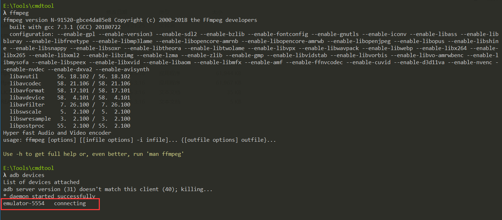
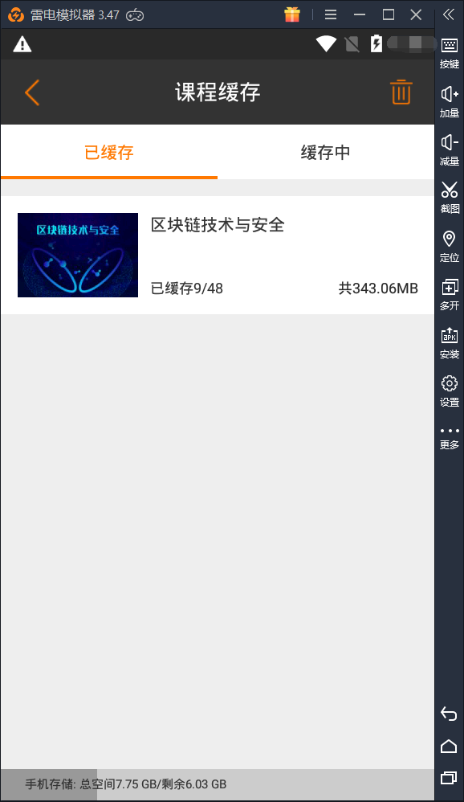
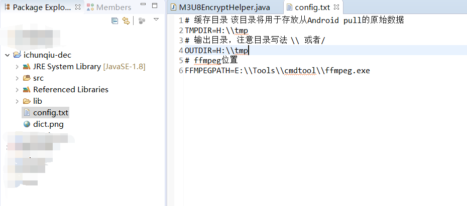
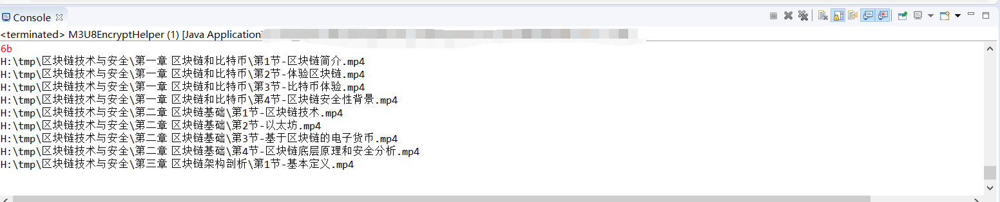

## 说明
1. 这是之前写的，只是想着能用代码写的很丑，不想费时间改了所以尽可能把把用法写详细。
2. 不是破解，只是解密会员或购买后缓存到本地的视频。
3. 分析过两个版本，解密方法有细微变化，本代码只能解本仓库提供的APP版本缓存的视频。
4. 求改代码，现在很脆弱很难用。。。

## 用法
1. 写的简陋，依赖ffmpeg，请自行下载。
2. 在config文件夹里配置下几个目录。
3. 将手机或模拟器连接电脑，安装adb并能正常连接且拥有root权限，否则请注释掉：
```java
pullData(TMPDIR);
```
并手动将`/sdcard/Android/data/com.ni.ichunqiu/VideoCache/`及`/data/data/com.ni.ichunqiu/databases/alldata.db`存放在TMPDIR下。
4. 运行`M3U8EncryptHelper.java`文件即可。

## 例
1. 检查adb与ffmpeg可用

2. 使用app缓存文件

3. 使用eclipse导入项目后，设置config.txt

4. 运行程序


## 问题
旧版APP启动时会联网检测更新，之后会强制请求更新，若出现这种事先断网再打开APP就好啦。
